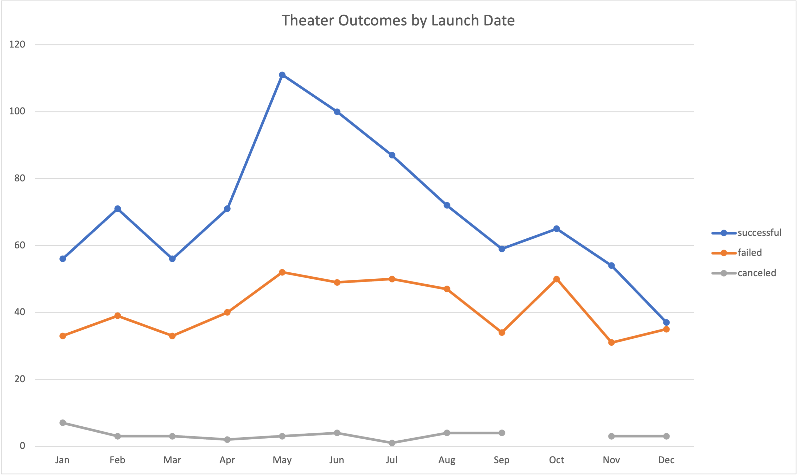
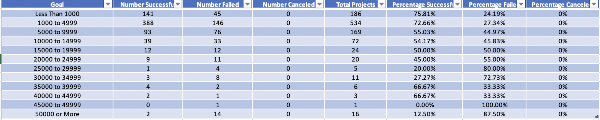

# Analysis of Kickstarter Theater Play Campaigns

## Overview of Project

### Purpose

The aim of this analysis is to provide insight on the outcomes of kickstarter theater campagins by analyzing a kickstarter dataset of aproximately 39,000 campagins. The data obtained from this analysis would be helpful for those who wish to fund a Kickstarter campaign, as the applied methodology can be replicated to any sort of campaign.

## Analysis and Challenges

### Analysis of Outcomes Based on Launch Date

The first part of the analysis seeks to obesrve the relationship between the outcome of the campaigns and their launch dates. In order to accomplish this, the following Pivot Table (Table1) was created in MS Excel from the Kickstarted Dataset:

#### Table 1: Pivot Table of Theater Campagins and their launch dates.


The previous Pivot Table was created by using the possible outcomes as columns, the count of the outcomes was used as the values for the table, the launch date was used to fill the rows with each month of the year and filters based on launch year and campaign category were applied. 

In order to obtain an accurate visual representation of the analyzed date, the following Line Chart (Chart 1) was created to observe more accurately the outcomes of theater campagins based on the month of the year: 

#### Chart 1:Line Chart of Theater Campagins and their launch dates


The previous chart was created as PivotChart from the data obtained in Table 1. The Y Axis represents the count of outcomes and the X axis displays months of the year.

### Analysis of Outcomes Based on Goals
The second part of the analysis was aimed towards analyzing the outcomes of theater campaigns based on their initial funding goals. To achieve this, the following table (Table 2) was created in order to display the campaigns' outcomes based on their original goals: 

#### Table 2: Chart of Outcomes Based on Goals


1. To populate columns related to the outcomes, the following excel formulas were used: 

-For first and last rows: 
```
=COUNTIFS(Kickstarter!D:D,"X",Kickstarter!F:F,"Y",Kickstarter!R:R,"plays")

Where 
X = the numerical criteria (less than/greater or equal to)
Y = the type of outcomde (successful/failed/canceled)
```

-For the rest of the rows: 
```
=COUNTIFS(Kickstarter!D:D,"X",Kickstarter!D:D,"Y",Kickstarter!F:F,"Z",Kickstarter!R:R,"plays")

Where
X = lower limit of goal range
Y = upper limit of goal range
Z = the type of outcomde (successful/failed/canceled)
```

2. The Total Projects column was populated by using the ``` =SUM()``` function. 

3. Finally, the percentages by outcome were calculated by dividing the count of each outcome by the total projects and then multiplying by 100. 


In order to obtain an accurate visual representation of the analyzed date, the following Line Chart (Chart 2) was created to observe more accurately the outcomes of theater campagins based on their initial goals:

#### Chart 2: Line Chart of Outcomes Based on Goals


The previous chart was created with the data obtained in Table 2; the Y Axis represents the count of outcomes and the X Axis shows the goal ranges. 


## Results

After rewviewing the two analysis, it was possible to reach the following conclusions: 

In regards to the analysis of outcomes based on launch date, it's posible to observe that the month in which the most campaigns were launched was May. Even though both the failed and successful campaigns observe an increase in May compared to the previous month, the increase in successful campagins is considerably bigger than that of the failed campaigns so, with further analysis, it may be possible to assume that May is the best month to launch a theater kickstarter campaign. 

When it comes to the worst month to launch a campaign, December registered the month with the lowest number of successful campaigns, therefore I would advise against starting a kickstarter campagin for a play on that month. 

Regarding the outcomes based on goals, the goal range of 1000 to 4999 registered the highest number of sucessful campaigns and a success rate of 72.66%. Even though the range of "Less than 1000" had a higher percentage of successful campaigns, the difference is of only 3.15%; choosing a funding goal lesser than $1,000 based solely on the percentage of successful campaigns is not advised. 

The Dataset seems rather robust, however, it would be interesting to have data from more years to see the results of the analysis based on launch date with a broader scope. On another topic, the format in which the original dataset displayed the dates required them to be transofmred to a readable forma.

Finally, based on the assumption that not every Kickstarter campaigns end once their goal has been reached, it would be interesting to know the date on which the campaign acheived its funding goal. The ability to obtain the average time that a campaign takes to reach its funding goal would be a valuable insight.

